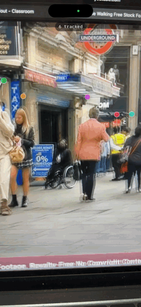

# Halo 🎈

Point your iPhone at people, and see the signal each of them chose to broadcast —
a small balloon tethered above their head, that opens when you tap it.



*Demo: Halo running against street footage. Each balloon is an independently
tracked person; colours are per-person, and tapping a balloon opens their message.*

## The idea

A grocery store in Finland offers bright pink carts to shoppers who are single —
an opt-in, anonymous, glanceable signal to everyone around them. Halo is that
idea as a digital layer: people voluntarily broadcast a small signal
("free for coffee", "anyone going to the hackathon?", the song they're playing),
and others see it floating above them in physical space.

The long-term canvas is AR glasses. The current prototype is an iPhone camera,
which is enough to prove the core interaction:

```text
rear camera ─► person detection ─► tracking ─► head anchoring ─► 🎈
```

## What works today

- Real-time person detection and body pose on-device (Vision, 15–30 passes/s on an iPhone 15)
- Frame-to-frame tracking with stable identities (IoU association)
- Balloons anchored to the *actual head* — works for people seated or reclining, not just standing
- Adaptive smoothing: steady on a still person, tight on a walking one
  (measured 0.003 jitter / 0.003 lag as fractions of frame width)
- Independent halos for multiple people, tap to open one at a time
- Rough distance estimation from apparent size, with a viewer-controlled radius filter

Identity is currently simulated — detected people get profiles from a local
cast. Real opt-in presence (Bluetooth/UWB) is the next phase; the design for it
is in [CLAUDE.md](CLAUDE.md).

## Privacy as architecture

Halo's core question is *"is this person voluntarily broadcasting?"* — never
*"who is this stranger?"*

- Opt-in only: someone without Halo isn't blurred or anonymised, they're **absent**
- No facial recognition, as a hard architectural rule
- All processing on-device; no footage stored
- Track identities are ephemeral — leave the frame and the system forgets you

## Stack

Swift + SwiftUI, AVFoundation for capture, Vision for detection and pose.
No dependencies, no backend. Requires a physical iPhone (the Simulator has no
camera); deployment target iOS 26.2.

## Status

A learning side project by a CS undergrad, built incrementally — see the commit
history for the actual engineering journey, including the measurements behind
each tracking decision. Built with [Claude Code](https://claude.com/claude-code)
as the implementation partner.
